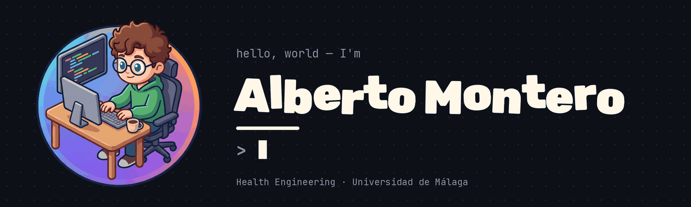
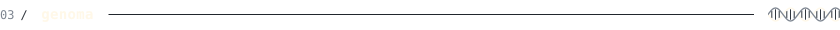
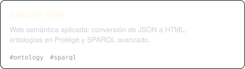
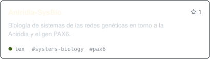
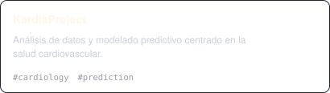
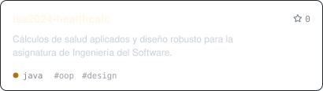

<!--
  This file is GENERATED by scripts/build.py from profile.toml.
  Edit profile.toml instead: manual changes here are overwritten.
-->

<picture><source media="(prefers-color-scheme: dark)" srcset="assets/banner/banner-dark.gif"><source media="(prefers-color-scheme: light)" srcset="assets/banner/banner-dark.gif"></picture>

 

<a href="https://es.linkedin.com/in/albeertomonterosolera">linkedin</a> &nbsp;·&nbsp; <a href="https://albertomontero.is-a.dev">portfolio</a> &nbsp;·&nbsp; <a href="README.md">english</a>

 

<picture><source media="(prefers-color-scheme: dark)" srcset="assets/generated/es/heading-about-dark.svg"><source media="(prefers-color-scheme: light)" srcset="assets/generated/es/heading-about-light.svg"></picture>

Estudiante de Ingeniería de la Salud y desarrollador full stack desde Málaga.
Convierto datos en bruto en conocimiento útil para la salud de las personas.

- **Ahora** — Ingeniería de la Salud en la Universidad de Málaga; después, Máster en Ingeniería del Software e IA.
- **Bio** — minería de datos, biología de sistemas y modelos predictivos en cáncer, genética y cardiología.
- **Grafos** — pipelines ETL hacia grafos de conocimiento RDF · DCAT, IDS, ODRL · SPARQL.
- **Web** — interfaces SaaS con autenticación segura y visualización en tiempo real.

 

<picture><source media="(prefers-color-scheme: dark)" srcset="assets/generated/es/heading-stack-dark.svg"><source media="(prefers-color-scheme: light)" srcset="assets/generated/es/heading-stack-light.svg"></picture>

<picture><source media="(prefers-color-scheme: dark)" srcset="assets/generated/es/stack-dark.svg"><source media="(prefers-color-scheme: light)" srcset="assets/generated/es/stack-light.svg"></picture>

 

<picture><source media="(prefers-color-scheme: dark)" srcset="assets/generated/es/heading-skills-dark.svg"><source media="(prefers-color-scheme: light)" srcset="assets/generated/es/heading-skills-light.svg"></picture>

<picture><source media="(prefers-color-scheme: dark)" srcset="assets/generated/es/genome-dark.svg"><source media="(prefers-color-scheme: light)" srcset="assets/generated/es/genome-light.svg"></picture>

 

<picture><source media="(prefers-color-scheme: dark)" srcset="assets/generated/es/heading-projects-dark.svg"><source media="(prefers-color-scheme: light)" srcset="assets/generated/es/heading-projects-light.svg"></picture>

<a href="https://github.com/monteero13/edowl"><picture><source media="(prefers-color-scheme: dark)" srcset="assets/generated/es/project-edowl-dark.svg"><source media="(prefers-color-scheme: light)" srcset="assets/generated/es/project-edowl-light.svg"></picture></a>
<a href="https://github.com/monteero13/No-BNo-Good"><picture><source media="(prefers-color-scheme: dark)" srcset="assets/generated/es/project-No-BNo-Good-dark.svg"><source media="(prefers-color-scheme: light)" srcset="assets/generated/es/project-No-BNo-Good-light.svg"></picture></a>
<a href="https://github.com/monteero13/Semanti-View"><picture><source media="(prefers-color-scheme: dark)" srcset="assets/generated/es/project-Semanti-View-dark.svg"><source media="(prefers-color-scheme: light)" srcset="assets/generated/es/project-Semanti-View-light.svg"></picture></a>
<a href="https://github.com/monteero13/Neo-Biotic"><picture><source media="(prefers-color-scheme: dark)" srcset="assets/generated/es/project-Neo-Biotic-dark.svg"><source media="(prefers-color-scheme: light)" srcset="assets/generated/es/project-Neo-Biotic-light.svg"></picture></a>
<a href="https://github.com/monteero13/Aniridia-SysBio"><picture><source media="(prefers-color-scheme: dark)" srcset="assets/generated/es/project-Aniridia-SysBio-dark.svg"><source media="(prefers-color-scheme: light)" srcset="assets/generated/es/project-Aniridia-SysBio-light.svg"></picture></a>
<a href="https://github.com/monteero13/KardiaProject"><picture><source media="(prefers-color-scheme: dark)" srcset="assets/generated/es/project-KardiaProject-dark.svg"><source media="(prefers-color-scheme: light)" srcset="assets/generated/es/project-KardiaProject-light.svg"></picture></a>
<a href="https://github.com/monteero13/Alcolens"><picture><source media="(prefers-color-scheme: dark)" srcset="assets/generated/es/project-Alcolens-dark.svg"><source media="(prefers-color-scheme: light)" srcset="assets/generated/es/project-Alcolens-light.svg"></picture></a>
<a href="https://github.com/monteero13/isa2024-healthcalc"><picture><source media="(prefers-color-scheme: dark)" srcset="assets/generated/es/project-isa2024-healthcalc-dark.svg"><source media="(prefers-color-scheme: light)" srcset="assets/generated/es/project-isa2024-healthcalc-light.svg"></picture></a>

 

<picture><source media="(prefers-color-scheme: dark)" srcset="assets/generated/es/heading-vitals-dark.svg"><source media="(prefers-color-scheme: light)" srcset="assets/generated/es/heading-vitals-light.svg"></picture>

<picture><source media="(prefers-color-scheme: dark)" srcset="assets/generated/es/vitals-dark.svg"><source media="(prefers-color-scheme: light)" srcset="assets/generated/es/vitals-light.svg"></picture>

 

generado desde profile.toml · @monteero13

