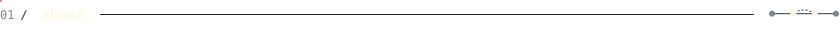
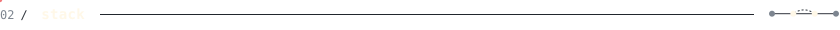
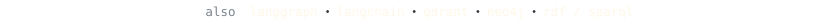
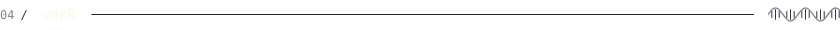
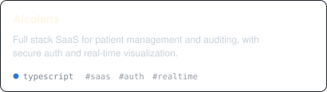
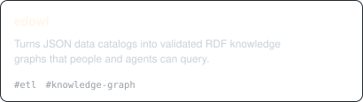
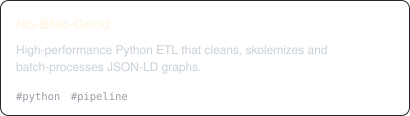
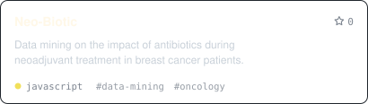

<!--
  This file is GENERATED by scripts/build.py from profile.toml.
  Edit profile.toml instead: manual changes here are overwritten.
-->

<picture><source media="(prefers-color-scheme: dark)" srcset="assets/generated/en/header-dark.svg"><source media="(prefers-color-scheme: light)" srcset="assets/generated/en/header-light.svg"></picture>

 

<a href="https://es.linkedin.com/in/albeertomonterosolera">linkedin</a> &nbsp;·&nbsp; <a href="https://albertomontero.is-a.dev">portfolio</a> &nbsp;·&nbsp; <a href="README.es.md">español</a>

 

<picture><source media="(prefers-color-scheme: dark)" srcset="assets/generated/en/heading-about-dark.svg"><source media="(prefers-color-scheme: light)" srcset="assets/generated/en/heading-about-light.svg"></picture>

I build AI systems that do real work: agents, automations and the full stack products around them.

- **Now** — AI & automation intern at **DEKRA**, designing agentic workflows with LangGraph and LangChain.
- **Build** — React / Next.js front ends, Python and Node back ends, data pipelines that feed the models.
- **Background** — Health Engineering at the University of Málaga, heading into a Master's in Software Engineering & AI.

 

<picture><source media="(prefers-color-scheme: dark)" srcset="assets/generated/en/heading-stack-dark.svg"><source media="(prefers-color-scheme: light)" srcset="assets/generated/en/heading-stack-light.svg"></picture>

<a href="https://skillicons.dev"><picture><source media="(prefers-color-scheme: dark)" srcset="https://skillicons.dev/icons?i=py%2Cr%2Cts%2Chtml%2Ccss%2Cpytorch%2Ctensorflow%2Csklearn%2Cfastapi%2Cnodejs%2Cmongodb%2Cpostgres%2Creact%2Cnextjs%2Ctailwind%2Cdocker%2Cgit%2Clinux&perline=9&theme=dark"><source media="(prefers-color-scheme: light)" srcset="https://skillicons.dev/icons?i=py%2Cr%2Cts%2Chtml%2Ccss%2Cpytorch%2Ctensorflow%2Csklearn%2Cfastapi%2Cnodejs%2Cmongodb%2Cpostgres%2Creact%2Cnextjs%2Ctailwind%2Cdocker%2Cgit%2Clinux&perline=9&theme=light"></picture></a>

<picture><source media="(prefers-color-scheme: dark)" srcset="assets/generated/en/stack-dark.svg"><source media="(prefers-color-scheme: light)" srcset="assets/generated/en/stack-light.svg"></picture>

 

<picture><source media="(prefers-color-scheme: dark)" srcset="assets/generated/en/heading-projects-dark.svg"><source media="(prefers-color-scheme: light)" srcset="assets/generated/en/heading-projects-light.svg"></picture>

<a href="https://github.com/monteero13/Alcolens"><picture><source media="(prefers-color-scheme: dark)" srcset="assets/generated/en/project-Alcolens-dark.svg"><source media="(prefers-color-scheme: light)" srcset="assets/generated/en/project-Alcolens-light.svg"></picture></a>
<a href="https://github.com/monteero13/edowl"><picture><source media="(prefers-color-scheme: dark)" srcset="assets/generated/en/project-edowl-dark.svg"><source media="(prefers-color-scheme: light)" srcset="assets/generated/en/project-edowl-light.svg"></picture></a>
<a href="https://github.com/monteero13/No-BNo-Good"><picture><source media="(prefers-color-scheme: dark)" srcset="assets/generated/en/project-No-BNo-Good-dark.svg"><source media="(prefers-color-scheme: light)" srcset="assets/generated/en/project-No-BNo-Good-light.svg"></picture></a>
<a href="https://github.com/monteero13/Neo-Biotic"><picture><source media="(prefers-color-scheme: dark)" srcset="assets/generated/en/project-Neo-Biotic-dark.svg"><source media="(prefers-color-scheme: light)" srcset="assets/generated/en/project-Neo-Biotic-light.svg"></picture></a>

 

built from profile.toml · @monteero13

